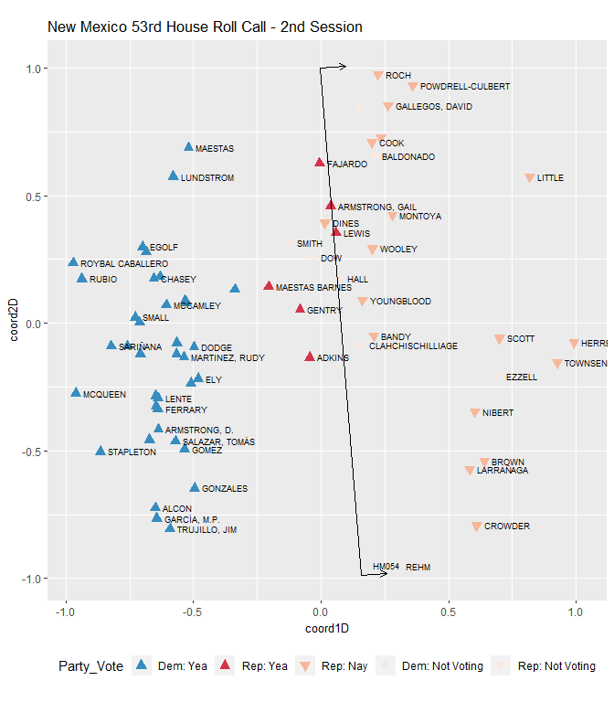
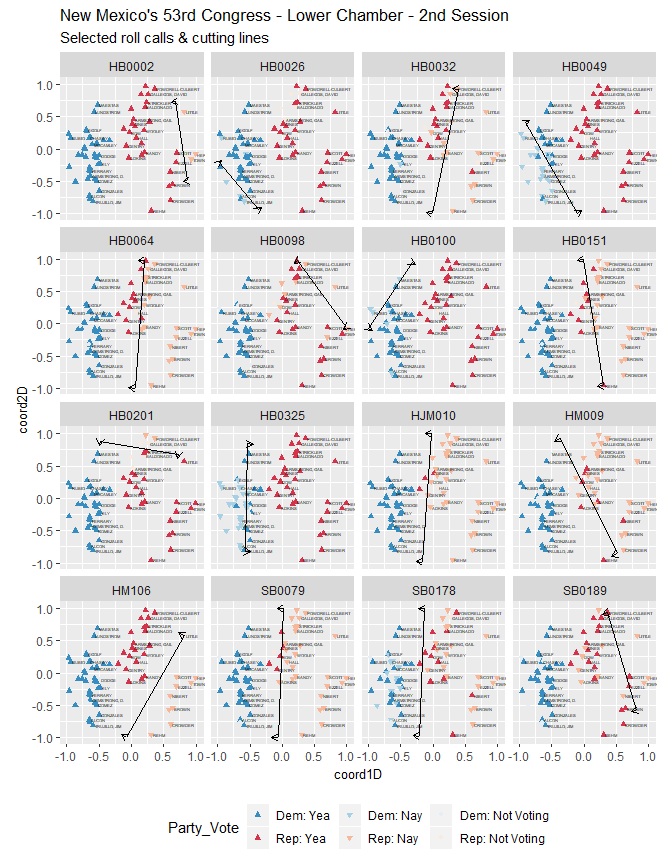

wnomadds
--------

This package performs two simple tasks based on the `wnominate` package: \* cutting lines \* angles

``` r
library(wnomadds)#devtools::install_github("jaytimm/wnomadds")
library(nmlegisdatr)#devtools::install_github("jaytimm/nmlegisdatr")
```

``` r
library(tidyverse)
library(wnominate)
library(pscl)
```

### Prepare data & run model

``` r
datFile <- nmlegisdatr::nml_rollcall  %>%
  filter(Chamber =='House' & !grepl('^LT', Representative)) %>%
  dplyr::select(Representative, Bill_ID, Rep_Vote) %>%
  spread(key= Bill_ID, value = Rep_Vote)
## Warning: package 'bindrcpp' was built under R version 3.4.4
```

``` r
datRC <- pscl::rollcall(datFile [,-1], 
                        yea='Yea',
                        nay='Nay',
                        missing=c('Excused', 'Absent', 'Rec'),
                        vote.names = colnames(datFile)[2:ncol(datFile)], 
                        legis.names = datFile$Representative)
```

Swap yea/nay to 1, 6, 9

``` r
datRC$votes [datRC$votes == 'Excused' | datRC$votes == 'Absent' | datRC$votes == 'Rec'] <- 9
datRC$votes [datRC$votes == 'Yea'] <- 1
datRC$votes [datRC$votes == 'Nay'] <- 6
```

``` r
resultd2 <- wnominate::wnominate (datRC, 
                       ubeta=15, 
                       uweights=0.5, 
                       dims=2, 
                       minvotes=20,
                       lop=0.025,trials=3, 
                       polarity=c(30,48),
                       verbose=FALSE)
## 
## Preparing to run W-NOMINATE...
## 
##  Checking data...
## 
##      All members meet minimum vote requirements.
## 
##      Votes dropped:
##      ... 234 of 290 total votes dropped.
## 
##  Running W-NOMINATE...
## 
##      Getting bill parameters...
##      Getting legislator coordinates...
##      Starting estimation of Beta...
##      Getting bill parameters...
##      Getting legislator coordinates...
##      Starting estimation of Beta...
##      Getting bill parameters...
##      Getting legislator coordinates...
##      Getting bill parameters...
##      Getting legislator coordinates...
##      Estimating weights...
##      Getting bill parameters...
##      Getting legislator coordinates...
##      Estimating weights...
##      Getting bill parameters...
##      Getting legislator coordinates...
## 
## 
## W-NOMINATE estimation completed successfully.
## W-NOMINATE took 2.38 seconds to execute.
```

### Plot two-dimensional model

``` r
row.names(resultd2$rollcalls) <- colnames(datFile)[2:ncol(datFile)]
```

Extract legislators from `nom` object. And add legislator details from `nmlegisdatr`.

``` r
house_data <- resultd2$legislators %>% 
  bind_cols(nml_legislators %>% 
              filter(Chamber == 'House' & !grepl('^LT', Representative))) 
```

``` r
house_data%>%
  ggplot(aes(x=coord1D, y=coord2D)) +
  geom_point(aes(color = Party),
             size= 2.5, 
             shape= 17) +
  nml_color_party()+ 
  theme(legend.position = 'bottom', 
        plot.title = element_text(size=13), 
        axis.title = element_text(size=10)) +
  geom_text(aes(label=Representative), 
            size=2.5, 
            check_overlap = TRUE, 
            hjust = 0, 
            nudge_x = 0.03)+
  labs(title="New Mexico's 53rd Congress - Lower Chamber - 2nd Session",
       subtitle = 'Legislator coordinates') +
  coord_equal(ratio=1) 
```


### Using `wnomadds`

Demonstrate how to extract cutting lines using `wnom_adds`.

``` r
with_cuts <- wnomadds::wnom_adds_get_cutlines(resultd2, rollcall_obj = datRC)
## Warning in FUN(newX[, i], ...): Couldn't solve for points on the unit circle!

## Warning in FUN(newX[, i], ...): Couldn't solve for points on the unit circle!
#Suppress warnings
```

The function returns cutline coordinates along with vote polarity.

``` r
head(with_cuts)
##          Bill_ID        x_1         x_2        y_1        y_2 pols
## 1:        HB0002  0.8715717  0.67587271 -0.4902681  0.7370184    1
## 2: HB0002HCONCUR  0.9903836 -0.47974198 -0.1383488  0.8774096    1
## 3:        HB0003  0.8715717  0.67587271 -0.4902681  0.7370184    1
## 4:        HB0026 -0.3645179 -0.97765640 -0.9311964 -0.2102093   -1
## 5:        HB0027 -0.3375543 -0.35960803 -0.9413061  0.9331035   -1
## 6:        HB0032  0.3891161 -0.01486458  0.9211887 -0.9998895   -1
##          x_1a       y_1a       x_2a       y_2a
## 1:  0.8102073 -0.5000531  0.6145084  0.7272334
## 2:  0.9395956 -0.2118551 -0.5305299  0.8039033
## 3:  0.8102073 -0.5000531  0.6145084  0.7272334
## 4: -0.3284686 -0.9005394 -0.9416070 -0.1795524
## 5: -0.2438338 -0.9402034 -0.2658876  0.9342061
## 6:  0.2930622  0.9413878 -0.1109185 -0.9796905
```

Plot legislators with cutting lines.

``` r
ggplot () + 
  nml_color_party() +
  theme(legend.position = 'bottom') +
  geom_point(data=house_data, 
               aes(x=coord1D, y=coord2D,color = Party),
               size= 2.5, 
               shape= 17) +
  geom_segment(data=with_cuts, 
               aes(x = x_1, y = y_1, xend = x_2, yend = y_2)) +
  geom_segment(data=with_cuts, 
               aes(x = x_2, y = y_2, xend = x_2a, yend = y_2a), 
               arrow = arrow(length = unit(0.2,"cm"))) +
  geom_segment(data=with_cuts, 
               aes(x = x_1, y = y_1, xend = x_1a, yend = y_1a), 
               arrow = arrow(length = unit(0.2,"cm")))+
  geom_text(data=with_cuts, 
               aes(x = x_1a, y = y_1a, label = Bill_ID), 
               size=2.5, 
               nudge_y = 0.03,
               check_overlap = TRUE) +
  coord_fixed(ratio=1) + 
  labs(title="New Mexico's 53rd Congress - Lower Chamber - 2nd Session",
       subtitle = 'Cutting lines & legislator coordinates')
```


Cutting line selections.

``` r
select_cuts <- c('HB0128')

sub <- nmlegisdatr::nml_rollcall %>%
  filter(Bill_ID %in% select_cuts) %>%
  inner_join(house_data)
## Joining, by = c("Chamber", "Representative")

cut_sub <- subset(with_cuts, Bill_ID %in% select_cuts)
```

``` r
sub %>%
ggplot(aes(x=coord1D, y=coord2D)) +
  geom_point(aes(color = Party_Vote, shape= Party_Vote, fill = Party_Vote),
             size= 2.5) +
  nmlegisdatr::nml_color_vote() +
  nmlegisdatr::nml_fill_vote() +
  nmlegisdatr::nml_shape_vote()+
  theme(legend.position = 'bottom', 
        plot.title = element_text(size=13), 
        axis.title = element_text(size=10)) +
  geom_text(aes(label=Representative), 
            size=2.5, 
            check_overlap = TRUE, 
            hjust = 0, 
            nudge_x = 0.03)+
  geom_segment(data=cut_sub, 
               aes(x = x_1, y = y_1, xend = x_2, yend = y_2)) +
  geom_segment(data=cut_sub, 
               aes(x = x_2, y = y_2, xend = x_2a, yend = y_2a), 
               arrow = arrow(length = unit(0.2,"cm"))) +
  geom_segment(data=cut_sub, 
               aes(x = x_1, y = y_1, xend = x_1a, yend = y_1a), 
               arrow = arrow(length = unit(0.2,"cm")))+
  geom_text(data=cut_sub, 
               aes(x = x_1a, y = y_1a, label = Bill_ID), 
               size=2.5, 
               nudge_y = 0.03,
               check_overlap = TRUE) +
  labs(title="New Mexico's 53rd Congress - Lower Chamber - 2nd Session",
       subtitle = 'Roll call & cutting line for House Bill 128') +
  coord_equal(ratio=1) 
```



View multiple roll calls.

``` r
select_cuts <- c('HB0032', 'HB0064', 'HB0100', 'HB0049', 'HB0325', 'HJM010',
                 'HM106', 'SB0079', 'HB0002', 'HB0026', 'HB0098', 'HB0151',
                 'HM009', 'HM54', 'SB0178', 'SB0189', 'HB0201')

sub <- nmlegisdatr::nml_rollcall %>%
  filter(Bill_ID %in% select_cuts) %>%
  inner_join(house_data)
## Joining, by = c("Chamber", "Representative")

cut_sub <- subset(with_cuts, Bill_ID %in% select_cuts)
```

``` r
sub %>%
ggplot(aes(x=coord1D, y=coord2D)) +
  geom_point(aes(color = Party_Vote, shape= Party_Vote, fill = Party_Vote),
             size= 1) +
  nmlegisdatr::nml_color_vote() +
  nmlegisdatr::nml_fill_vote() +
  nmlegisdatr::nml_shape_vote()+
  theme(legend.position = 'bottom', 
        plot.title = element_text(size=13), 
        axis.title = element_text(size=10)) +
  geom_text(aes(label=Representative), 
            size=1, 
            check_overlap = TRUE, 
            hjust = 0, 
            nudge_x = 0.03)+
  geom_segment(data=cut_sub, 
               aes(x = x_1, y = y_1, xend = x_2, yend = y_2)) +
  geom_segment(data=cut_sub, 
               aes(x = x_2, y = y_2, xend = x_2a, yend = y_2a), 
               arrow = arrow(length = unit(0.2,"cm"))) +
  geom_segment(data=cut_sub, 
               aes(x = x_1, y = y_1, xend = x_1a, yend = y_1a), 
               arrow = arrow(length = unit(0.2,"cm")))+
  labs(title="New Mexico's 53rd Congress - Lower Chamber - 2nd Session",
       subtitle = 'Selected roll calls & cutting lines') +
  coord_equal(ratio=1)+
  facet_wrap(~Bill_ID, ncol = 4)
```



### Extracting cutting line angles

Cutting line angles can be useful in identifying legislation that ....

``` r
wnomadds::wnom_adds_get_angles(resultd2)
##          Bill_ID     angle
## 1         HB0002  99.05992
## 2  HB0002HCONCUR 145.35812
## 3         HB0003  99.05992
## 4         HB0026 130.37835
## 5         HB0027  90.67409
## 6         HB0032  78.12439
## 7         HB0038  72.39469
## 8         HB0049 119.98586
## 9         HB0064  85.84058
## 10        HB0079 114.05671
## 11        HB0086 128.01552
## 12        HB0088  83.69249
## 13        HB0098 126.73838
## 14        HB0100  56.47210
## 15        HB0128 150.82107
## 16        HB0147  26.36730
## 17        HB0151  99.04523
## 18        HB0158 119.40342
## 19        HB0191 108.41618
## 20        HB0201 171.13636
## 21        HB0235  40.75652
## 22        HB0319  90.00000
## 23        HB0325  88.68296
## 24        HJM009  96.94850
## 25        HJM010  86.01559
## 26        HJR001  82.65788
## 27         HM009 116.38980
## 28         HM054  94.57762
## 29         HM055  60.50492
## 30         HM056  60.50492
## 31         HM090  60.50492
## 32         HM094  60.50492
## 33         HM097  60.50492
## 34         HM103  60.50492
## 35         HM104  60.50492
## 36         HM106  60.50492
## 37        SB0017 131.16694
## 38        SB0018 120.79985
## 39        SB0079  87.51689
## 40  SB0079HTABLE 100.64087
## 41        SB0109  78.51012
## 42        SB0176  90.00000
## 43        SB0178  87.57717
## 44        SB0189 106.69100
## 45        SJM008  60.50492
## 46        SJM015  60.50492
```
