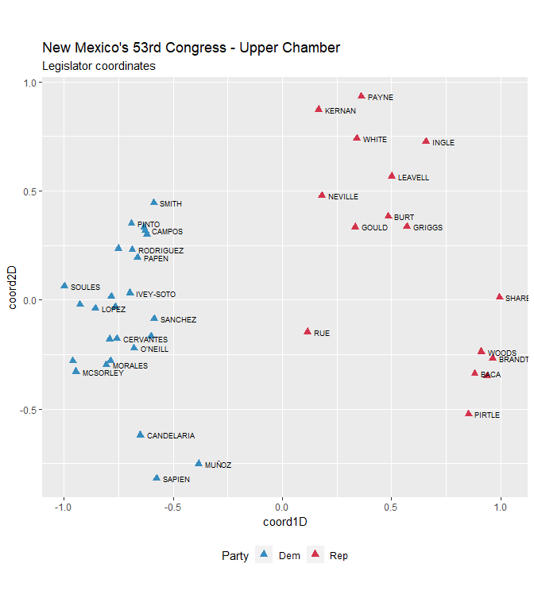
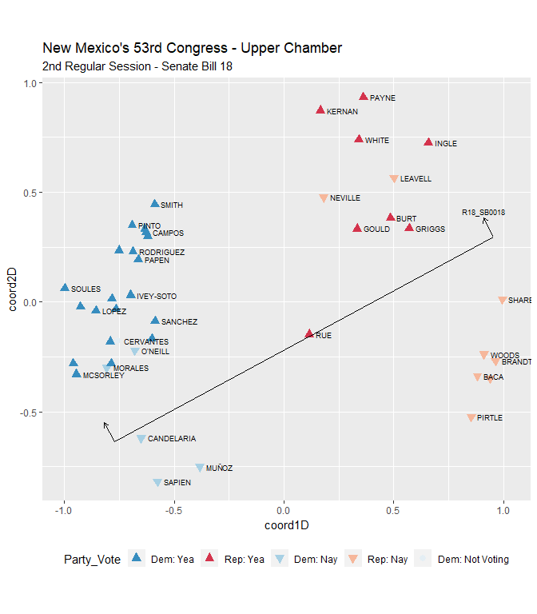
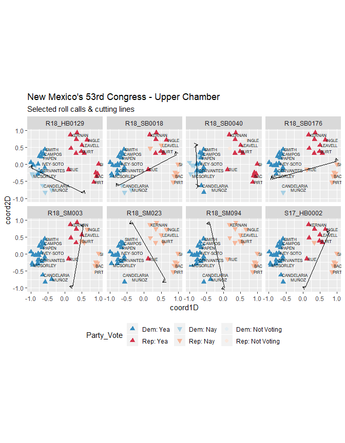

wnomadds
--------

This package performs two simple tasks based on the `wnominate` package: \* cutting lines \* angles

``` r
library(wnomadds)#devtools::install_github("jaytimm/wnomadds")
library(nmlegisdatr)#devtools::install_github("jaytimm/nmlegisdatr")
```

``` r
library(tidyverse)
library(wnominate)
library(pscl)
```

### Prepare data & run model

``` r
datFile <- nml_rollcall  %>%
  filter(Chamber =='House' & !grepl('^LT', Representative)) %>%
  mutate(Bill_ID = paste(Year, Session, Bill_ID, sep="_")) %>%
  dplyr::select(Representative, Bill_ID, Rep_Vote) %>%
  spread(key= Bill_ID, value = Rep_Vote)
## Warning: package 'bindrcpp' was built under R version 3.4.4
```

``` r
datFile <- nmlegisdatr::nml_rollcall  %>%
  filter(Chamber =='Senate' & !grepl('^LT', Representative)) %>%
  dplyr::select(Representative, Bill_Code, Rep_Vote) %>%
  spread(key= Bill_Code, value = Rep_Vote)
```

``` r
datRC <- pscl::rollcall(datFile [,-1], 
                        yea='Yea',
                        nay='Nay',
                        missing=c('Excused', 'Absent', 'Rec'),
                        vote.names = colnames(datFile)[2:ncol(datFile)], 
                        legis.names = datFile$Representative)
```

Swap yea/nay to 1, 6, 9

``` r
datRC$votes [datRC$votes == 'Excused' | datRC$votes == 'Absent' | datRC$votes == 'Rec' | is.na(datRC$votes)] <- 9
datRC$votes [datRC$votes == 'Yea'] <- 1
datRC$votes [datRC$votes == 'Nay'] <- 6  ##is.na above is not right.
```

``` r
resultd2 <- wnominate::wnominate (datRC, 
                       ubeta=15, 
                       uweights=0.5, 
                       dims=2, 
                       minvotes=20,
                       lop=0.025,trials=3, 
                       polarity=c(1,3),
                       verbose=FALSE)
## 
## Preparing to run W-NOMINATE...
## 
##  Checking data...
## 
##      All members meet minimum vote requirements.
## 
##      Votes dropped:
##      ... 516 of 740 total votes dropped.
## 
##  Running W-NOMINATE...
## 
##      Getting bill parameters...
##      Getting legislator coordinates...
##      Starting estimation of Beta...
##      Getting bill parameters...
##      Getting legislator coordinates...
##      Starting estimation of Beta...
##      Getting bill parameters...
##      Getting legislator coordinates...
##      Getting bill parameters...
##      Getting legislator coordinates...
##      Estimating weights...
##      Getting bill parameters...
##      Getting legislator coordinates...
##      Estimating weights...
##      Getting bill parameters...
##      Getting legislator coordinates...
## 
## 
## W-NOMINATE estimation completed successfully.
## W-NOMINATE took 5.47 seconds to execute.
```

### Plot two-dimensional model

``` r
row.names(resultd2$rollcalls) <- colnames(datFile)[2:ncol(datFile)]
```

Extract legislators from `nom` object. And add legislator details from `nmlegisdatr`.

``` r
house_data <- resultd2$legislators %>% 
  bind_cols(nml_legislators %>% 
              filter(Chamber == 'Senate' & !grepl('^LT', Representative))) 
```

``` r
house_data%>%
  ggplot(aes(x=coord1D, y=coord2D)) +
  geom_point(aes(color = Party),
             size= 2.5, 
             shape= 17) +
  nml_color_party()+ 
  theme(legend.position = 'bottom') +
  geom_text(aes(label=Representative), 
            size=2.5, 
            check_overlap = TRUE, 
            hjust = 0, 
            nudge_x = 0.03)+
  coord_fixed(ratio=1)  +
  labs(title="New Mexico's 53rd Congress - Upper Chamber",
       subtitle = 'Legislator coordinates') 
```



### Using `wnomadds`

Demonstrate how to extract cutting lines using `wnom_adds`.

``` r
with_cuts <- wnomadds::wnom_adds_get_cutlines(resultd2, rollcall_obj = datRC)
## Warning in FUN(newX[, i], ...): Couldn't solve for points on the unit circle!
#Suppress warnings
```

The function returns cutline coordinates along with vote polarity.

``` r
head(with_cuts)
##      Bill_Code       x_1         x_2         y_1        y_2 pols      x_1a
## 1:  R17_HB0001 0.7611899  0.66757317  0.64852911 -0.7445442   -1 0.6915362
## 2: R17_HB00012 0.7611899  0.66757317  0.64852911 -0.7445442   -1 0.6915362
## 3:  R17_HB0002 0.9781846 -0.21362665  0.20773749 -0.9769154   -1 0.9189520
## 4:  R17_HB0063 0.7662343  0.47683292 -0.64256127  0.8789940    1 0.6901565
## 5:  R17_HB0080 0.9974388 -0.66671682  0.07152501 -0.7453111   -1 0.9565970
## 6:  R17_HB0086 0.6445311 -0.01234074 -0.76457809  0.9999239    1 0.5563060
##          y_1a       x_2a       y_2a
## 1:  0.6532099  0.5979195 -0.7398634
## 2:  0.6532099  0.5979195 -0.7398634
## 3:  0.2673281 -0.2728593 -0.9173248
## 4: -0.6570313  0.4007552  0.8645239
## 5:  0.1547328 -0.7075586 -0.6621033
## 6: -0.7974217 -0.1005658  0.9670803
```

Plot legislators with cutting lines.

``` r
ggplot () + 
  nml_color_party() +
  theme(legend.position = 'bottom') +
  geom_point(data=house_data, 
               aes(x=coord1D, y=coord2D,color = Party),
               size= 2.5, 
               shape= 17) +
  geom_segment(data=with_cuts, 
               aes(x = x_1, y = y_1, xend = x_2, yend = y_2)) +
  geom_segment(data=with_cuts, 
               aes(x = x_2, y = y_2, xend = x_2a, yend = y_2a), 
               arrow = arrow(length = unit(0.2,"cm"))) +
  geom_segment(data=with_cuts, 
               aes(x = x_1, y = y_1, xend = x_1a, yend = y_1a), 
               arrow = arrow(length = unit(0.2,"cm")))+
  geom_text(data=with_cuts, 
               aes(x = x_1a, y = y_1a, label = Bill_Code), 
               size=2.5, 
               nudge_y = 0.03,
               check_overlap = TRUE) +
  coord_fixed(ratio=1) + 
  labs(title="New Mexico's 53rd Congress - Upper Chamber",
       subtitle = 'Cutting lines & legislator coordinates')
```


Cutting line selections.

``` r
select_cuts <- c('R18_SB0018')

sub <- nmlegisdatr::nml_rollcall %>%
  filter(Bill_Code %in% select_cuts) %>%
  inner_join(house_data)
## Joining, by = c("Chamber", "Representative")

cut_sub <- subset(with_cuts, Bill_Code %in% select_cuts)
```

``` r
sub %>%
ggplot(aes(x=coord1D, y=coord2D)) +
  geom_point(aes(color = Party_Vote, shape= Party_Vote, fill = Party_Vote),
             size= 2.5) +
  nmlegisdatr::nml_color_vote() +
  nmlegisdatr::nml_fill_vote() +
  nmlegisdatr::nml_shape_vote()+
  theme(legend.position = 'bottom', 
        plot.title = element_text(size=13), 
        axis.title = element_text(size=10)) +
  geom_text(aes(label=Representative), 
            size=2.5, 
            check_overlap = TRUE, 
            hjust = 0, 
            nudge_x = 0.03)+
  geom_segment(data=cut_sub, 
               aes(x = x_1, y = y_1, xend = x_2, yend = y_2)) +
  geom_segment(data=cut_sub, 
               aes(x = x_2, y = y_2, xend = x_2a, yend = y_2a), 
               arrow = arrow(length = unit(0.2,"cm"))) +
  geom_segment(data=cut_sub, 
               aes(x = x_1, y = y_1, xend = x_1a, yend = y_1a), 
               arrow = arrow(length = unit(0.2,"cm")))+
  geom_text(data=cut_sub, 
               aes(x = x_1a, y = y_1a, label = Bill_Code), 
               size=2.5, 
               nudge_y = 0.03,
               check_overlap = TRUE) +
  coord_equal(ratio=1) +
  labs(title="New Mexico's 53rd Congress - Upper Chamber",
       subtitle = '2nd Regular Session - Senate Bill 18') 
```



View multiple roll calls.

``` r
select_cuts <- with_cuts$Bill_Code[61:72]
select_cuts <- c('R18_HB0129', 'R18_SB0018', 'R18_SB0176',
                 'R18_SB0040', 'S17_HB0002', 'R18_SM003', 'R18_SM094', 
                 'R18_SM023')

sub <- nmlegisdatr::nml_rollcall %>%
  filter(Bill_Code %in% select_cuts) %>%
  inner_join(house_data)
## Joining, by = c("Chamber", "Representative")

cut_sub <- subset(with_cuts, Bill_Code %in% select_cuts)
```

``` r
sub %>%
ggplot(aes(x=coord1D, y=coord2D)) +
  geom_point(aes(color = Party_Vote, shape= Party_Vote, fill = Party_Vote),
             size= 2) +
  nmlegisdatr::nml_color_vote() +
  nmlegisdatr::nml_fill_vote() +
  nmlegisdatr::nml_shape_vote()+
  theme(legend.position = 'bottom') +
  geom_text(aes(label=Representative), 
            size=2, 
            check_overlap = TRUE, 
            hjust = 0, 
            nudge_x = 0.03)+
  geom_segment(data=cut_sub, 
               aes(x = x_1, y = y_1, xend = x_2, yend = y_2)) +
  geom_segment(data=cut_sub, 
               aes(x = x_2, y = y_2, xend = x_2a, yend = y_2a), 
               arrow = arrow(length = unit(0.2,"cm"))) +
  geom_segment(data=cut_sub, 
               aes(x = x_1, y = y_1, xend = x_1a, yend = y_1a), 
               arrow = arrow(length = unit(0.2,"cm")))+
  coord_equal(ratio=1)+
  labs(title="New Mexico's 53rd Congress - Upper Chamber",
       subtitle = 'Selected roll calls & cutting lines') +
  facet_wrap(~Bill_Code, ncol = 4)
```



### Extracting cutting line angles

Cutting line angles can be useful in identifying legislation that ....

``` r
angles <- wnomadds::wnom_adds_get_angles(resultd2)
head(angles)
##     Bill_Code     angle
## 1  R17_HB0001  86.15542
## 2 R17_HB00012  86.15542
## 3  R17_HB0002  44.82741
## 4  R17_HB0063 100.76908
## 5  R17_HB0080  26.14371
## 6  R17_HB0086 110.41881
```
