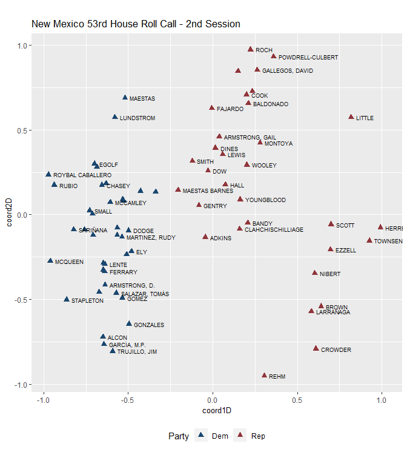
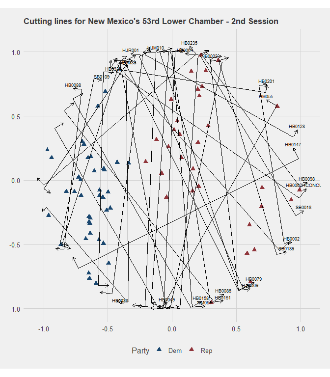

``` r
library(wnomadds)#devtools::install_github("jaytimm/wnomadds")
library(nmlegisdatr)#devtools::install_github("jaytimm/nmlegisdatr")
```

``` r
library(tidyverse)
library(wnominate)
library(pscl)
```

``` r
datFile <- nmlegisdatr::nml_rollcall  %>%
  filter(Chamber =='House' & !grepl('^LT', Representative)) %>%
  dplyr::select(Representative, Bill_ID, Rep_Vote) %>%
  spread(key= Bill_ID, value = Rep_Vote)
## Warning: package 'bindrcpp' was built under R version 3.4.4
```

``` r
datRC <- pscl::rollcall(datFile [,-1], 
                        yea='Yea',
                        nay='Nay',
                        missing=c('Excused', 'Absent', 'Rec'),
                        vote.names = colnames(datFile)[2:ncol(datFile)], 
                        legis.names = datFile$Representative)
```

Swap yea/nay to 1, 6, 9

``` r
datRC$votes [datRC$votes == 'Excused' | datRC$votes == 'Absent' | datRC$votes == 'Rec'] <- 9
datRC$votes [datRC$votes == 'Yea'] <- 1
datRC$votes [datRC$votes == 'Nay'] <- 6
```

``` r
resultd2 <- wnominate::wnominate (datRC, 
                       ubeta=15, 
                       uweights=0.5, 
                       dims=2, 
                       minvotes=20,
                       lop=0.025,trials=3, 
                       polarity=c(1,1),
                       verbose=FALSE)
## 
## Preparing to run W-NOMINATE...
## 
##  Checking data...
## 
##      All members meet minimum vote requirements.
## 
##      Votes dropped:
##      ... 234 of 290 total votes dropped.
## 
##  Running W-NOMINATE...
## 
##      Getting bill parameters...
##      Getting legislator coordinates...
##      Starting estimation of Beta...
##      Getting bill parameters...
##      Getting legislator coordinates...
##      Starting estimation of Beta...
##      Getting bill parameters...
##      Getting legislator coordinates...
##      Getting bill parameters...
##      Getting legislator coordinates...
##      Estimating weights...
##      Getting bill parameters...
##      Getting legislator coordinates...
##      Estimating weights...
##      Getting bill parameters...
##      Getting legislator coordinates...
## 
## 
## W-NOMINATE estimation completed successfully.
## W-NOMINATE took 2.65 seconds to execute.
```

``` r
row.names(resultd2$rollcalls) <- colnames(datFile)[2:ncol(datFile)]
```

Extract legislators from `nom` object. And add legislator details from `nmlegisdatr`.

``` r
house_data <- resultd2$legislators %>% #May need to remove NAs
  bind_cols(nml_legislators %>% 
              filter(Chamber == 'House' & !grepl('^LT', Representative))) 
```

``` r
library(ggthemes)
house_data%>%
  ggplot(aes(x=coord1D, y=coord2D)) +
  geom_point(aes(color = Party),
             size= 2.5, 
             shape= 17) +
  scale_colour_stata() + 
  #theme_fivethirtyeight() +
  theme(legend.position = 'bottom', 
        plot.title = element_text(size=13), 
        axis.title = element_text(size=10)) +
  ylab ("Dimension 2") +
  xlab ("Dimension 1") +
  geom_text(aes(label=Representative), 
            size=2.5, 
            check_overlap = TRUE, 
            hjust = 0, 
            nudge_x = 0.03)+
  labs(title="New Mexico 53rd House Roll Call - 2018") +
  coord_equal(ratio=1)
```



Demonstrate how to extract cutting lines using `wnom_adds`.

``` r
with_cuts <- wnomadds::wnom_adds_get_cutlines(resultd2, rollcall_obj =   datRC)
## Warning in FUN(newX[, i], ...): Couldn't solve for points on the unit circle!

## Warning in FUN(newX[, i], ...): Couldn't solve for points on the unit circle!
#Suppress warnings
```

``` r
head(with_cuts)
##          Bill_ID        x_1         x_2        y_1        y_2 pols
## 1:        HB0002  0.8715717  0.67587271 -0.4902681  0.7370184   -1
## 2: HB0002HCONCUR  0.9903836 -0.47974198 -0.1383488  0.8774096   -1
## 3:        HB0003  0.8715717  0.67587271 -0.4902681  0.7370184   -1
## 4:        HB0026 -0.3645179 -0.97765640 -0.9311964 -0.2102093    1
## 5:        HB0027 -0.3375543 -0.35960803 -0.9413061  0.9331035    1
## 6:        HB0032  0.3891161 -0.01486458  0.9211887 -0.9998895   -1
##          x_1a        y_1a        x_2a       y_2a
## 1:  0.9209479 -0.48239478  0.72524892  0.7448917
## 2:  1.0188058 -0.09721277 -0.45131972  0.9185457
## 3:  0.9209479 -0.48239478  0.72524892  0.7448917
## 4: -0.4026071 -0.96358797 -1.01574556 -0.2426009
## 5: -0.3875508 -0.94189431 -0.40960457  0.9325152
## 6:  0.3401862  0.93147811 -0.06379441 -0.9896001
```

Plot legislators with cutting lines.

``` r
ggplot () + 
  scale_colour_stata() + 
  #theme_fivethirtyeight() +
  theme(plot.title = element_text(size=13),
        legend.position = 'bottom') +
  geom_point(data=house_data, 
               aes(x=coord1D, y=coord2D,color = Party),
               size= 2.5, 
               shape= 17) +
  geom_segment(data=with_cuts, 
               aes(x = x_1, y = y_1, xend = x_2, yend = y_2)) +
  geom_segment(data=with_cuts, 
               aes(x = x_2, y = y_2, xend = x_2a, yend = y_2a), 
               arrow = arrow(length = unit(0.2,"cm"))) +
  geom_segment(data=with_cuts, 
               aes(x = x_1, y = y_1, xend = x_1a, yend = y_1a), 
               arrow = arrow(length = unit(0.2,"cm")))+
  geom_text(data=with_cuts, 
               aes(x = x_1a, y = y_1a, label = Bill_ID), 
               size=2.5, 
               nudge_y = 0.03,
               check_overlap = TRUE) +
  coord_fixed(ratio=1) + 
  labs(title="Cutting lines for New Mexico's 53rd Lower Chamber - 2nd Session")
```


