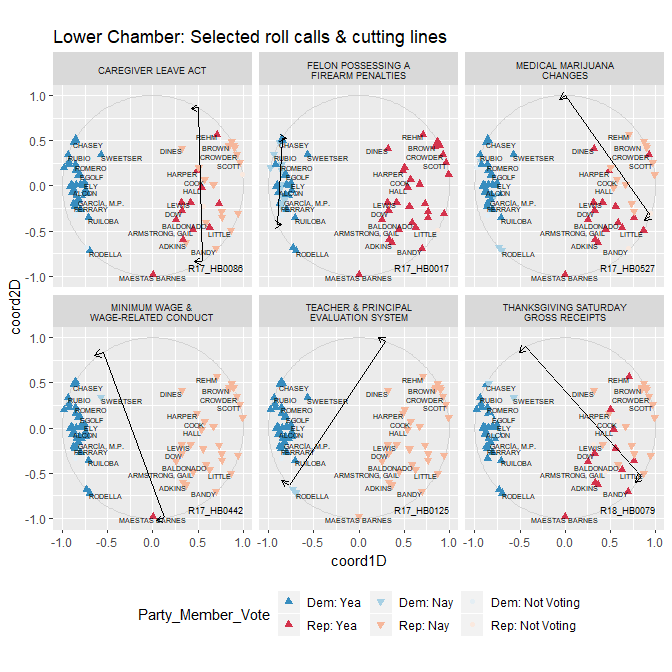

wnomadds
========

An R package that provides (very unofficial) add-on functionality to the [NOMINATE-VoteView Project](https://voteview.com/)'s `wnominate` package. Functions included in the package extract/output the coordinates and angles of roll call cutting lines, ie, the data underyling plots generated by `wnominate::plot.cutlines()` and `wnominate::plot.angles()`, respectively.

`wnomadds` analogue functions are dubbed `wnm_get_cutlines()` and `wnm_get_angles()`; both functions are based on existing `wnominate` code, tweaked only to output data frames as opposed to base R plots. `wnomadds::wnm_get_cutlines()` includes the added functionality of allowing users to add arrows at the end of cutting lines to specify roll call polarity.

------------------------------------------------------------------------

Installation
------------

``` r
library(devtools)
devtools::install_github("jaytimm/wnomadds")
library(wnomadds)
```

Usage
-----

To demonstrate the functionality and utility of the `wnomadds` package, we first quickly walk through the NOMINATE ideal points estimation procedure via `wnominate` using roll call data from the **53rd Congress of the New Mexico State Legislature** made available via the `nmlegisdatr` package.

``` r
library(nmlegisdatr)#devtools::install_github("jaytimm/nmlegisdatr")
library(tidyverse)
library(wnominate)
library(pscl)
```

### Prepare data & run wnominate model

#### Reshape data for Senate roll calls

``` r
wide_rolls <- nmlegisdatr::nml_rollcall  %>%
  filter(Chamber =='House') %>%
  mutate(Bill_Unique = paste0(Bill_Code, substr(Motion, 1,1))) %>%
  dplyr::select(Representative, Bill_Unique, Member_Vote) %>%
  mutate(Member_Vote = case_when(Member_Vote == "Yea" ~ 1,
                              Member_Vote == "Nay" ~ 6,
                              Member_Vote %in% c("Excused", "Absent", "Rec") ~ 9)) %>%
  spread(key= Bill_Unique, value = Member_Vote)
```

#### Create rollcall object

``` r
roll_obj <- pscl::rollcall(wide_rolls [,-1], 
                           yea = 1,
                           nay = 6,
                           missing = 9,
                           notInLegis = NA,
                           vote.names = colnames(wide_rolls)[2:ncol(wide_rolls)], 
                           legis.names = wide_rolls$Representative)
```

#### Build model

``` r
ideal_2d <- wnominate::wnominate (roll_obj, 
                                  ubeta=15, 
                                  uweights=0.5, 
                                  dims=2, 
                                  minvotes=20,
                                  lop=0.025,
                                  trials=3, 
                                  polarity=c('TOWNSEND', 'REHM'),
                                  verbose=FALSE)
## 
## Preparing to run W-NOMINATE...
## 
##  Checking data...
## 
##      All members meet minimum vote requirements.
## 
##      Votes dropped:
##      ... 612 of 803 total votes dropped.
## 
##  Running W-NOMINATE...
## 
##      Getting bill parameters...
##      Getting legislator coordinates...
##      Starting estimation of Beta...
##      Getting bill parameters...
##      Getting legislator coordinates...
##      Starting estimation of Beta...
##      Getting bill parameters...
##      Getting legislator coordinates...
##      Getting bill parameters...
##      Getting legislator coordinates...
##      Estimating weights...
##      Getting bill parameters...
##      Getting legislator coordinates...
##      Estimating weights...
##      Getting bill parameters...
##      Getting legislator coordinates...
## 
## 
## W-NOMINATE estimation completed successfully.
## W-NOMINATE took 7.68 seconds to execute.
```

``` r
row.names(ideal_2d$rollcalls) <- colnames(wide_rolls)[2:ncol(wide_rolls)]
```

#### Extract legislators coordinates from `nomObj` object

``` r
house_data <- ideal_2d$legislators %>% 
  bind_cols(nml_legislators %>% 
              filter(Chamber == 'House')) 
```

### wnomadds::get\_cutlines()

The `wnm_get_cutlines()` function returns a data frame of cutting line coordinates. The function takes a `nomObj` object and a `rollcall` object (from call to `pscl::rollcall`). If the `add_arrows` parameter is set to `TRUE`, additionally included in the data frame are coordinates of points perpendicular to cutting line ends in the direction of maximum Yea's (per roll call). The distance between these points and the cutting line (ie, arrow length) can be specified by the `arrow_length` parameter.

``` r
with_cuts <- wnomadds::wnm_get_cutlines(ideal_2d, 
                                        rollcall_obj = roll_obj, 
                                        add_arrows = TRUE,
                                        arrow_length = 0.05)
```

#### Sample output

Output effectively contains four sets of points:

-   x\_1, y\_1: cutting line start
-   x\_2, y\_2: cutting line end
-   x\_1a, y\_1a: point perpendicular to cutting line start, `arrow_length` away in the direction of max Yea's
-   x\_2a, y\_2a: point perpendicular to cutting line end, `arrow_length` away in the direction of max Yea's

``` r
head(with_cuts)
##      Bill_Code        x_1       y_1        x_2        y_2       x_1a
## 1: R17_HB0004P  0.4787966 0.8779259 -0.3051518 -0.9523037  0.3872851
## 2: R17_HB0011P  0.4833821 0.8754095 -0.5342280 -0.8453404  0.3973446
## 3: R17_HB0016P -0.8637753 0.5038772 -0.9080242 -0.4189177 -0.8176356
## 4: R17_HB0017P -0.8498559 0.5270151 -0.9031616 -0.4293008 -0.8020401
## 5: R17_HB0028P  0.8640101 0.5034744  0.7760351 -0.6306897  0.8073019
## 6: R17_HB0032P  0.7934022 0.6086978  0.7599459 -0.6499863  0.7304680
##         y_1a       x_2a       y_2a
## 1: 0.9171233 -0.3966633 -0.9131063
## 2: 0.9262900 -0.6202655 -0.7944599
## 3: 0.5016647 -0.8618844 -0.4211302
## 4: 0.5243498 -0.8553458 -0.4319661
## 5: 0.5078732  0.7193269 -0.6262909
## 6: 0.6103706  0.6970117 -0.6483135
```

#### Plot legislator coordinates & cutting lines with arrows indicating polarity

The four sets of points included in the output of `wnomadds::get_cutlines` can be used to create three line segments via `geom_plot`: cutting start to cutting end, cutting start to opposite arrow, and cutting end to opposite arrow.

``` r
ggplot () + 
  wnomadds::scale_color_party() +
  theme(legend.position = 'bottom') +
          annotate("path",
               x=cos(seq(0,2*pi,length.out=300)),
               y=sin(seq(0,2*pi,length.out=300)),
               color='lightgray',
               size = .25) +
  geom_point(data=house_data, 
               aes(x=coord1D, y=coord2D,color = Party),
               size= 3, 
               shape= 17) +
  geom_segment(data=with_cuts, 
               aes(x = x_1, y = y_1, xend = x_2, yend = y_2)) + #cutting start to end
  geom_segment(data=with_cuts, 
               aes(x = x_2, y = y_2, xend = x_2a, yend = y_2a), #cutting end to opposite arrow
               arrow = arrow(length = unit(0.2,"cm"))) +
  geom_segment(data=with_cuts, 
               aes(x = x_1, y = y_1, xend = x_1a, yend = y_1a), #cutting start to opposite arrow
               arrow = arrow(length = unit(0.2,"cm")))+
  geom_text(data=with_cuts, 
               aes(x = x_1a, y = y_1a, label = Bill_Code), 
               size=2.5, 
               nudge_y = 0.03,
               check_overlap = TRUE) +
  coord_fixed(ratio=1) + 
  labs(title="Lower chamber: Cutting lines & legislator coordinates")
```


#### Select some example cutting lines

``` r
#select_cuts <- with_cuts$Bill_Code[112:123]
select_cuts <- c('R18_HB0079', 'R17_HB0442', 'R17_HB0017',
                 'R17_HB0086', 'R17_HB0125', 'R17_HB0527')

sub <- nmlegisdatr::nml_rollcall %>%
  filter(Bill_Code %in% select_cuts) %>%
  inner_join(house_data) %>%
  inner_join(nml_legislation) 

cut_sub <- subset(with_cuts, Bill_Code %in% paste0(select_cuts,'P')) %>%
  mutate(Bill_Code = gsub('.$', '', Bill_Code)) %>%
  inner_join(nml_legislation) 
```

#### Facet plot of multiple cutting lines

``` r
sub %>%
ggplot(aes(x=coord1D, y=coord2D)) +
        annotate("path",
               x=cos(seq(0,2*pi,length.out=300)),
               y=sin(seq(0,2*pi,length.out=300)),
               color='lightgray',
               size = .25) +
  geom_point(aes(color = Party_Member_Vote, 
                 shape= Party_Member_Vote, 
                 fill = Party_Member_Vote),
             size= 1.5) +
  wnomadds::scale_color_rollcall() +
  wnomadds::scale_fill_rollcall() +
  wnomadds::scale_shape_rollcall() +
  theme(legend.position = 'bottom') +
  geom_text(aes(label=Representative), 
            size=1.75, 
            check_overlap = TRUE, 
            hjust = "inward",
            nudge_y = -0.03)+
  coord_fixed() +
  geom_segment(data=cut_sub, 
               aes(x = x_1, y = y_1, xend = x_2, yend = y_2)) +
  geom_segment(data=cut_sub, 
               aes(x = x_2, y = y_2, xend = x_2a, yend = y_2a), 
               arrow = arrow(length = unit(0.2,"cm"))) +
  geom_segment(data=cut_sub, 
               aes(x = x_1, y = y_1, xend = x_1a, yend = y_1a), 
               arrow = arrow(length = unit(0.2,"cm")))+
  geom_text(data=cut_sub, 
               aes(x = .7, y = -1, label = Bill_Code), 
               size=2.25, 
               nudge_y = 0.1,
               check_overlap = TRUE) +
  labs(title="Lower chamber: Selected roll calls & cutting lines") +
  facet_wrap(~Bill_Title, labeller = label_wrap_gen(), ncol = 3) +
  theme(strip.text = element_text(size=7))
```



### wnomadds::get\_angles()

Cutting line angles can be extracted from a `nomObj` object using `wnomadds::wnm_get_angles()`. Output is a simple data frame.

``` r
angles <- wnomadds::wnm_get_angles(ideal_2d)
head(angles)
##     Bill_Code    angle
## 1 R17_HB0004P 66.81293
## 2 R17_HB0011P 59.40095
## 3 R17_HB0016P 87.25472
## 4 R17_HB0017P 86.80960
## 5 R17_HB0028P 85.56456
## 6 R17_HB0032P 88.47742
```
